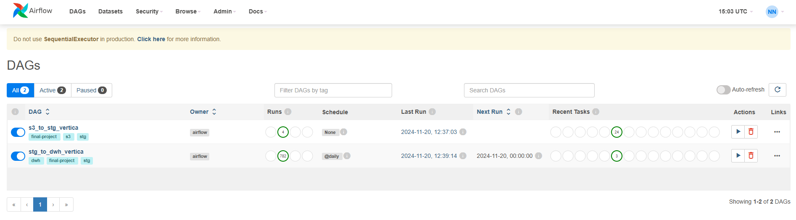

# Итоговый проект

### Описание
Репозиторий предназначен для сдачи итогового проекта.

### Структура репозитория
- `/src/dags` - даги
- `/src/dags/sql` - миграции
- `/src/dags/py` - скрипты
- `/src/image` - дашборд

### Архитектура взаимодействия микросервисов

  

### Панель управления дагами в Airflow

  

### Граф запуска тасок в Airflow

  

### Дашборд

  

